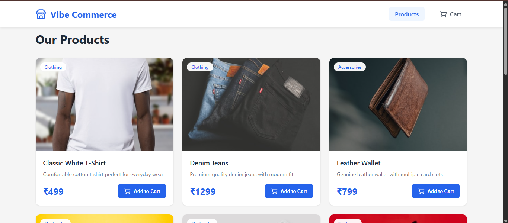
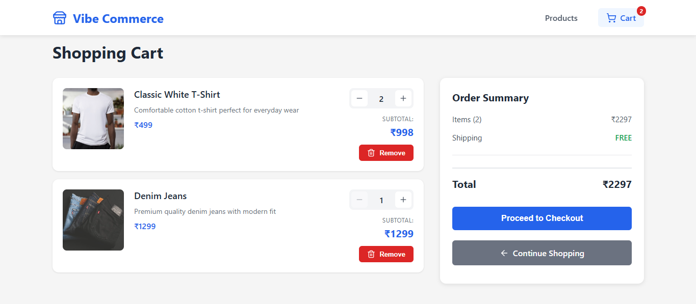
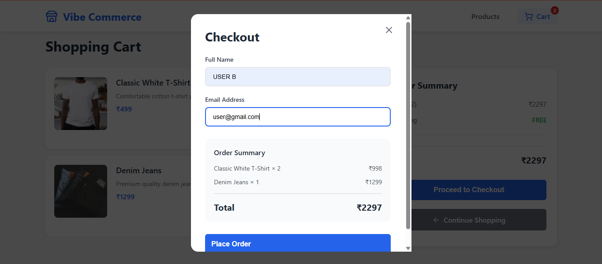

# 🛒 E-Commerce Shopping Cart


A full-stack e-commerce shopping cart application built with **React**, **Node.js**, **Express**, and **MongoDB**. Features a complete product catalog, shopping cart management, checkout process, and order tracking system.

## 🎥 Demo Video

> **[Watch Demo Video](YOUR_VIDEO_LINK_HERE)** - 2 minute walkthrough of the application

## 📑 Table of Contents

- [Screenshots](#-screenshots)
- [Features](#-features)
- [Tech Stack](#️-tech-stack)
- [Project Structure](#-project-structure)
- [Installation & Setup](#-installation--setup)
- [API Endpoints](#-api-endpoints)
- [Usage](#-usage)

## 📸 Screenshots

### Products Page


### Shopping Cart


### Checkout Modal


## 🚀 Features

- **Product Catalog**: Browse 10 mock products with images, descriptions, and prices
- **Shopping Cart**: Add, remove, and update product quantities
- **Real-time Updates**: Cart count updates instantly across the application
- **Checkout Flow**: Simple checkout form with order confirmation
- **Order Persistence**: All orders saved to MongoDB with complete details
- **Order Tracking**: View all past orders with customer information
- **Mock Receipt**: Generates order receipt with unique order ID and timestamp
- **Responsive Design**: Works seamlessly on desktop, tablet, and mobile devices
- **Modern UI**: Clean and intuitive interface with smooth animations
- **MongoDB Database**: Scalable NoSQL database for products, cart, and orders
- **RESTful API**: Well-structured backend API with proper error handling
- **Detailed Logging**: Comprehensive server-side logging for debugging

## 🛠️ Tech Stack

### Frontend
- **React.js** - UI framework
- **React Router** - Client-side routing
- **Axios** - HTTP client
- **Lucide React** - Modern icon library
- **CSS3** - Styling with responsive design

### Backend
- **Node.js** - Runtime environment
- **Express.js** - Web framework
- **MongoDB** - NoSQL database
- **Mongoose** - MongoDB ODM
- **UUID** - Unique order ID generation
- **CORS** - Cross-origin resource sharing
- **dotenv** - Environment configuration

## 📁 Project Structure

```
E-Commerce Cart/
│
├── backend/
│   ├── config/
│   │   └── database.js      # MongoDB connection & initialization
│   ├── models/
│   │   ├── Product.js       # Product schema
│   │   ├── Cart.js          # Cart schema
│   │   └── Order.js         # Order schema
│   ├── routes/
│   │   ├── products.js      # Product API routes
│   │   ├── cart.js          # Cart API routes
│   │   └── checkout.js      # Checkout & Orders API routes
│   ├── server.js            # Express server setup
│   ├── package.json
│   ├── .env                 # Environment variables
│   ├── .env.example         # Environment template
│   ├── check-mongodb.js     # MongoDB connection checker
│   ├── check-data.js        # Database data viewer
│   └── view-orders.js       # Order history viewer
│
├── frontend/
│   ├── public/
│   │   └── index.html
│   ├── src/
│   │   ├── components/
│   │   │   ├── Navbar.js
│   │   │   ├── ProductCard.js
│   │   │   ├── CartItem.js
│   │   │   └── CheckoutModal.js
│   │   ├── pages/
│   │   │   ├── ProductsPage.js
│   │   │   └── CartPage.js
│   │   ├── api.js           # API service functions
│   │   ├── App.js
│   │   └── index.js
│   └── package.json
│
├── screenshots/             # Application screenshots
├── README.md
├── MONGODB_MIGRATION.md     # MongoDB setup guide
└── ORDER_TRACKING.md        # Order management documentation
```

## 🔧 Installation & Setup

### Prerequisites
- Node.js (v14 or higher)
- npm or yarn

### Backend Setup

1. **Install MongoDB**:
   - Download and install MongoDB Community Server from [mongodb.com](https://www.mongodb.com/try/download/community)
   - MongoDB will run automatically as a Windows service
   - Alternatively, use MongoDB Atlas (cloud) - see `MONGODB_MIGRATION.md`

2. Navigate to the backend directory:
```bash
cd backend
```

3. Install dependencies:
```bash
npm install
```

4. Configure environment variables:
```bash
# Copy the example file
copy .env.example .env

# Edit .env and set your MongoDB URI (default works for local MongoDB):
MONGODB_URI=mongodb://localhost:27017/ecommerce-cart
```

5. Start the backend server:
```bash
npm start
```

The backend server will run on `http://localhost:5000`

For development with auto-reload:
```bash
npm run dev
```

**Verify MongoDB Connection:**
```bash
node check-mongodb.js
```

### Frontend Setup

1. Open a new terminal and navigate to the frontend directory:
```bash
cd frontend
```

2. Install dependencies:
```bash
npm install
```

3. Start the React development server:
```bash
npm start
```

The frontend will run on `http://localhost:3000` and automatically open in your browser.

## 🔌 API Endpoints

### Products
- `GET /api/products` - Get all products
- `GET /api/products/:id` - Get single product by ID

### Cart
- `GET /api/cart` - Get cart items with total
- `POST /api/cart` - Add item to cart
  ```json
  {
    "productId": 1,
    "quantity": 2
  }
  ```
- `PUT /api/cart/:id` - Update cart item quantity
  ```json
  {
    "quantity": 3
  }
  ```
- `DELETE /api/cart/:id` - Remove item from cart
- `DELETE /api/cart` - Clear entire cart

### Checkout & Orders
- `POST /api/checkout` - Process checkout and save order
  ```json
  {
    "name": "John Doe",
    "email": "john@example.com",
    "cartItems": [...]
  }
  ```
- `GET /api/checkout/orders` - Get all orders
- `GET /api/checkout/orders/:orderId` - Get specific order by ID

## 💡 Key Features Explained

### 1. Product Management
- 10 pre-loaded mock products with real images from Unsplash
- Products stored in MongoDB with Mongoose schemas
- Categories include Clothing, Electronics, Accessories, etc.
- Auto-populated on first server start

### 2. Cart Functionality
- Add products with quantity control
- Update quantities with +/- buttons
- Remove individual items
- Real-time subtotal and total calculation
- Persistent cart data in database

### 3. Checkout Process
- Simple form with name and email validation
- Order summary display
- Order saved to MongoDB with:
  - Unique order ID (UUID)
  - Customer details
  - Itemized list
  - Total amount
  - Order status
  - Timestamps (created/updated)
- Mock receipt generation
- Cart automatically clears after successful checkout
- View all orders: `node view-orders.js`

### 4. Responsive Design
- Mobile-first approach
- Breakpoints for tablet and desktop
- Touch-friendly buttons and controls
- Optimized layouts for all screen sizes

## 🎨 UI/UX Highlights

- **Modern Design**: Clean, professional interface with card-based layouts
- **Visual Feedback**: Hover effects, transitions, and loading states
- **Color Scheme**: Blue primary color (#2563eb) with semantic colors for actions
- **Icons**: Lucide React icons for consistent, modern iconography
- **Animations**: Smooth fade-in and slide-up animations
- **Empty States**: Helpful messages when cart is empty

## 🧪 Testing the Application

### Test Flow:
1. **Browse Products**: View all products on the home page
2. **Add to Cart**: Click "Add to Cart" on multiple products
3. **View Cart**: Click cart icon in navbar (shows item count)
4. **Update Quantities**: Use +/- buttons to adjust quantities
5. **Remove Items**: Click "Remove" button to delete items
6. **Checkout**: Click "Proceed to Checkout"
7. **Complete Order**: Fill in name and email, submit
8. **View Receipt**: See order confirmation with details

## 🔒 Error Handling

- Product not found errors
- Invalid quantity validation
- Empty cart checkout prevention
- Network error handling
- User-friendly error messages

## 🚀 Future Enhancements

- User authentication and accounts
- Product search and filtering
- Product categories navigation
- Wishlist functionality
- Order history
- Payment gateway integration
- Product reviews and ratings
- Inventory management
- Admin dashboard

## 📝 Notes

- This is a **mock application** for demonstration purposes
- No real payment processing
- Database resets on server restart (can be modified for persistence)
- Images are loaded from Unsplash CDN

## 👨‍💻 Development

### Backend Development
```bash
cd backend
npm run dev  # Runs with nodemon for auto-reload
```

### Frontend Development
```bash
cd frontend
npm start  # Runs with hot-reload
```

## 📦 Dependencies

### Backend
- express: ^4.18.2
- cors: ^2.8.5
- dotenv: ^16.3.1
- mongoose: ^8.0.0
- uuid: ^9.0.1

### Frontend
- react: ^18.2.0
- react-dom: ^18.2.0
- react-router-dom: ^6.18.0
- axios: ^1.6.0
- lucide-react: ^0.292.0

## 🎮 Usage

### Testing the Application

1. **Browse Products**
   - View all 10 products on the home page
   - Each product shows image, name, description, price, and category

2. **Add to Cart**
   - Click "Add to Cart" on any product
   - Watch the cart count update in the navbar
   - Products are added to MongoDB database

3. **Manage Cart**
   - Click the cart icon to view your cart
   - Update quantities using +/- buttons
   - Remove items with the "Remove" button
   - See real-time total calculation

4. **Checkout**
   - Click "Proceed to Checkout"
   - Fill in your name and email
   - Review order summary
   - Submit order

5. **Order Confirmation**
   - Receive order confirmation with unique order ID
   - Order is saved permanently in MongoDB
   - Cart is automatically cleared

### API Testing

You can test the API endpoints using tools like Postman or curl:

```bash
# Get all products
curl http://localhost:5000/api/products

# Get cart items
curl http://localhost:5000/api/cart

# Add to cart
curl -X POST http://localhost:5000/api/cart \
  -H "Content-Type: application/json" \
  -d '{"productId":"PRODUCT_ID","quantity":1}'

# Get all orders
curl http://localhost:5000/api/checkout/orders
```

## 📄 License

This project is created for educational and screening purposes.

## 👨‍💻 Author

**Tanmay**
- GitHub: [@tanmay34567](https://github.com/tanmay34567)
- Repository: [e-commerce-shopping-cart](https://github.com/tanmay34567/e-commerce-shopping-cart)

## 🤝 Contributing

This is a screening test project. For any questions or issues, please contact the repository owner.

## 🙏 Acknowledgments

- Product images from [Unsplash](https://unsplash.com)
- Icons from [Lucide React](https://lucide.dev)
- Built for Vibe Commerce screening test

---

<div align="center">

**Built with ❤️ using React, Node.js, Express & MongoDB**

⭐ Star this repository if you found it helpful!

</div>